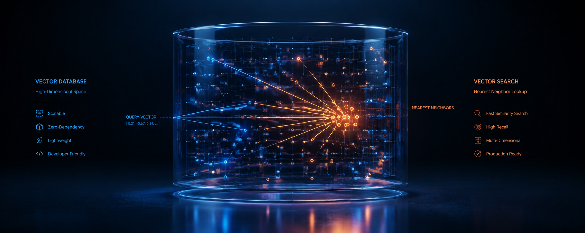

# vectorDB-With-Rust 

<p align="center">
      
</p>

A lightweight, **zero-dependency** vector database written in Rust for semantic similarity search.

Store high-dimensional embeddings, query with cosine similarity, and retrieve the top-*k* nearest neighbours — all in-memory, all in safe Rust, with no external crates.

---

## Table of contents

- [Features](#features)
- [Quick start](#quick-start)
- [How it works](#how-it-works)
- [API reference](#api-reference)
- [Project layout](#project-layout)
- [Running the project](#running-the-project)
- [Design decisions](#design-decisions)
- [Extending the project](#extending-the-project)

---

## 🔧 Features 

-  **In-memory storage** — `HashMap`-backed, O(1) insert, delete, and direct lookup
-  **Cosine similarity** — implemented from scratch with float-safety guards
-  **Top-*k* search** — returns results sorted by descending similarity score
-  **Upsert semantics** — inserting an existing id overwrites the record in place
-  **Zero dependencies** — compiles against the Rust standard library only
-  **Fully tested** — 35+ unit and integration tests across all modules

---

## 🚀 Quick start 

```rust
use vectordb_with_rust::db::VectorDB;

fn main() {
    let mut db = VectorDB::new();

    // Store embeddings (in practice: output of a sentence-transformer model)
    db.insert("rust-book".to_string(),  vec![0.9, 0.1, 0.0], Some("The Rust Programming Language".to_string()));
    db.insert("ml-crash".to_string(),   vec![0.1, 0.9, 0.2], Some("ML Crash Course".to_string()));
    db.insert("deep-learn".to_string(), vec![0.0, 0.8, 0.9], Some("Deep Learning".to_string()));

    // Query: find the 2 most semantically similar documents
    let results = db.search(&[0.05, 0.85, 0.85], 2);

    for r in &results {
        println!("{:.4}  {}", r.score, r.record.metadata.as_deref().unwrap());
    }
    // 0.9991  Deep Learning
    // 0.9682  ML Crash Course
}
```

---

## 🧠 How it works 

### Embeddings

An embedding is a vector of floating-point numbers that represents the *meaning* of a piece of data. Similar items — documents about the same topic, images of the same object — land close together in the vector space. This database stores those vectors and searches over them.

```
"machine learning"  →  [0.05, 0.90, 0.88, ...]
"deep learning"     →  [0.03, 0.85, 0.92, ...]   ← close to the above
"HTTP protocol"     →  [0.02, 0.05, 0.04, ...]   ← far from the above
```

### 📐 Cosine similarity 

The similarity between two vectors is computed as the cosine of the angle between them:

```
         a · b
cos(a,b) = ─────────
           ‖a‖ · ‖b‖
```

- **1.0** — identical direction (perfectly similar) ✅
- **0.0** — orthogonal (no similarity) ⚪
- **−1.0** — opposite direction ↔️

Cosine similarity is **scale-invariant**: a vector and its scaled copy are considered identical. This means embedding magnitude does not affect ranking, only direction does. Pre-normalising your query vectors with `vector::normalize` is a good habit but not required — the math is the same either way.

### 🔎 Search algorithm 

Search is a **full linear scan**: every stored record is scored with cosine similarity against the query, the results are sorted, and the top *k* are returned. This is O(n × d) where *n* is the number of records and *d* is the embedding dimension.

For the educational scale this project targets (thousands of records), the scan is fast enough. For larger corpora, the scan loop in `db.rs` can be swapped for an approximate index (HNSW, IVF) without changing the public API.

---

## 📑 API reference 

### `VectorDB`

```rust
use vectordb_with_rust::db::VectorDB;
```

#### Construction ⚙️

```rust
// Empty database
let mut db = VectorDB::new();

// Pre-allocate for known corpus size (avoids HashMap rehashing)
let mut db = VectorDB::with_capacity(10_000);
```

#### `insert` ➕

```rust
pub fn insert(&mut self, id: VectorId, embedding: Vec<f32>, metadata: Option<String>) -> bool
```

Store a vector. Returns `true` if an existing record was overwritten, `false` on a fresh insert. The id can be any non-empty string — a UUID, a file path, a slug.

```rust
db.insert("doc-1".to_string(), vec![0.9, 0.1, 0.0], Some("Rust systems programming".to_string()));

// Overwrite an existing record (re-embed without deleting first)
let was_overwrite = db.insert("doc-1".to_string(), new_embedding, None);
assert!(was_overwrite);
```

#### `search` 🔍

```rust
pub fn search(&self, query: &[f32], top_k: usize) -> Vec<SearchResult>
```

Return the `top_k` most similar records, sorted by descending cosine similarity score. Returns an empty `Vec` when the database is empty or `top_k == 0`.

```rust
let results = db.search(&query_embedding, 5);

for r in &results {
    println!("{:.4}  {}  {:?}", r.score, r.record.id, r.record.metadata);
}
```

#### `delete` 🗑️

```rust
pub fn delete(&mut self, id: &str) -> bool
```

Remove a record. Returns `true` if the record existed, `false` if it was not found (no-op).

```rust
let removed = db.delete("doc-1");
```

#### `get` 📥

```rust
pub fn get(&self, id: &str) -> Option<&VectorRecord>
```

Direct O(1) lookup by id. Returns `None` if no record has that id.

```rust
if let Some(record) = db.get("doc-1") {
    println!("dim: {}", record.dim());
}
```

#### Other methods

```rust
db.len()        // number of stored records
db.is_empty()   // true if no records
db.clear()      // remove all records
db.ids()        // iterator over all ids
```

---

### `VectorRecord`

Returned by `get` and nested inside `SearchResult`:

```rust
pub struct VectorRecord {
    pub id:        VectorId,       // String
    pub embedding: Vec<f32>,
    pub metadata:  Option<String>,
}

record.dim()  // embedding.len()
```

### `SearchResult`

Returned by `search`:

```rust
pub struct SearchResult {
    pub record: VectorRecord,
    pub score:  f32,          // cosine similarity in [−1.0, 1.0]
}
```

---

### 📐 Vector math (`vectordb_with_rust::vector`) 

The math layer is also public and can be used directly:

```rust
use vectordb_with_rust::vector::{cosine_similarity, magnitude, normalize, dot_product};

let a = vec![3.0_f32, 4.0];
let b = vec![1.0_f32, 0.0];

println!("{}", magnitude(&a));            // 5.0
println!("{}", cosine_similarity(&a, &b));// 0.6
println!("{:?}", normalize(&a));          // [0.6, 0.8]
println!("{}", dot_product(&a, &b));      // 3.0
```

---

## ▶️ Running the project 

```bash
# Clone and enter the project
git clone <repo-url>
cd vectorDB-With-Rust

# Run the built-in demo
cargo run

# Run all tests (unit + integration)
cargo test

# Run only integration tests
cargo test --test integration_test

# Run the semantic search example
cargo run --example semantic_search

# Check formatting and lints
cargo fmt --check
cargo clippy
```

### Expected output (`cargo run`) 🖥️

```
╔══════════════════════════════════════╗
║           vectorDB — Rust            ║
╚══════════════════════════════════════╝

✓ Stored 8 documents

┌─ Query: "machine learning"
│  1. score=0.9994  [ml-intro]    Introduction to machine learning
│  2. score=0.9971  [deep-learn]  Deep learning and neural networks
│  3. score=0.9924  [transformers] Transformer architecture and attention
└─

┌─ Query: "systems programming"
│  1. score=0.9999  [rust]        Rust systems programming language
│  2. score=0.9966  [python]      Python programming language
│  3. score=0.8431  [databases]   Relational databases and SQL
└─
...
```

---

## 🎯 Design decisions 

**`f32` over `f64`** — Embedding similarity does not need double precision. `f32` halves memory usage for large corpora and maps directly to what most embedding models output.

**`HashMap` as the store** — O(1) insert, delete, and `get` at the cost of O(n) search. For this project the linear scan is intentional: the algorithm is maximally readable and correct by inspection. The `HashMap` key (the `VectorId` string) is also the natural handle for callers to manage their records.

**Upsert semantics on `insert`** — Requiring a separate `delete` before re-embedding a document would be an unnecessary footgun. Overwriting silently and returning a `bool` to signal which case occurred is the ergonomic choice.

**`clamp` on cosine scores** — Floating-point arithmetic on nearly-unit vectors can produce values like `1.0000002`. Clamping to `[-1.0, 1.0]` after the division keeps scores in the documented range without silently producing `NaN` downstream.

**Zero-vector guard returns `0.0`** — Cosine similarity is mathematically undefined for the zero vector (division by zero). Returning `NaN` would silently corrupt sort order. Returning `0.0` (no similarity) keeps scores comparable and safe.

**`sort_unstable_by` for ranking** — Unstable sort is faster than stable sort and the tie-breaking order between equal-score results does not matter for semantic search.

---

## 📄 License 

This project is licensed under the **MIT License**.  
See the `LICENSE` file for more details.
